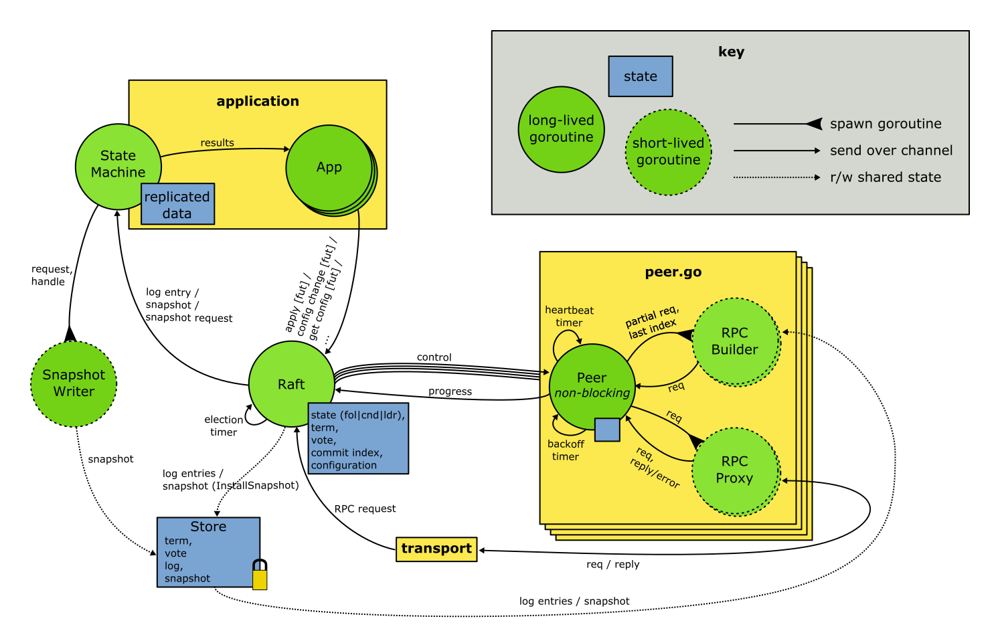

## Architecture

#### Note: Portions of this diagram, especially regarding snapshots, are aspirational.

### Raft module and Store

All application requests are converted into *futures* and sent to the *Raft module* (often called simply "Raft"), including requests to append and commit a new state machine command into the log. Each future contains a channel for the Raft module to send back errors and results, and the application can block on the future's completion. As a leader, the Raft module will process these, but as a follower and candidate, the Raft module will reject most requests with an error.

The Raft module keeps some key state locally, such as whether it's currently a follower, candidate, or leader. The *Store* persists metadata such as the current term and vote, the log, and any snapshots; it does locking internally at a fine granularity so that it can be accessed directly from different modules.

As a follower, the Raft module processes RPC requests that come in from the *Transport*, and in response to these, it casts its vote or writes entries or snapshots into the store. It also becomes a candidate when the election timer fires, and it triggers writing new snapshots on occasion.

### Peers

As a candidate and leader, the Raft module must take a more active role to issue RPCs to the rest of the cluster. It sends out this work to *Peer* routines, requesting that they seek votes or replicate entries through a *control* structure, and checks their *progress* reports after RPCs complete. Once a majority of the voting members of the cluster grant a vote, the candidate becomes a leader. Similarly, once a majority acknowledge an entry from the current term, the leader marks it committed.

The main *Peer* goroutine is strictly nonblocking. It does small amounts of communication and then goes back to sending and receiving on its various channels. Generating RPC requests may block. For example, preparing an AppendEntries request that needs log entries from the store may read from disk. Preparing requests is done using short-lived goroutines. Once the request is prepared, the Peer checks the term number in its latest control structure, and it discards requests that were created during prior terms (these might be invalid if log entries were replaced from the store concurrently, and they're not needed). Once it has a complete request, the Peer sends this over to the Transport using another short-lived goroutine (the Transport provides mostly blocking calls). The Peer keeps state to ensure that it's not sending too many RPCs at the same time.

This design permits the Raft module to send control structures to the Peer over an unbuffered channel in a timely manner, and it ensures the Peer module can send out heartbeats at regular intervals, even if it's concurrently building up a large request.

### State Machine

#### Note: This section is aspirational. It does not describe how the library is organized today.

The Raft module will feed snapshots and committed entries for the *State Machine* goroutine to apply. When the Raft module decides to take a new snapshot, it collects some meta-information and sends a snapshot request over to the State Machine. The State Machine then spawns a short-lived goroutine to write out a copy of its state into the store.
