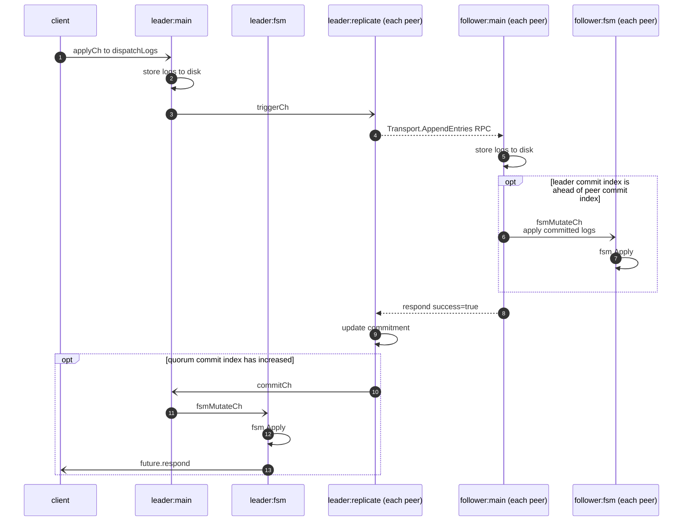

# Raft Apply

Apply is the primary operation provided by raft. A client calls `raft.Apply` to apply
a command to the FSM. A command will first be commited, i.e., durably stored on a
quorum of raft nodes. Then, the committed command is applied to fsm.

This sequence diagram shows the steps involved in a `raft.Apply` operation. Each box
across the top is a separate thread. The name in the box identifies the state of the peer
(leader or follower) and the thread (`<peer state>:<thread name>`). When there are
multiple copies of the thread, it is indicated with `(each peer)`.



Following is the description of each step as shown in the above diagram

1. The raft node handles the `raft.Apply` call by creating a new log entry and send the entry
to the `applyCh` channel.

2. If the node is not a leader, the method will return an error of `ErrNotLeader`. Otherwise,
the main loop of the leader node calls `raft.dispatchLogs` to write the log entry locally.

3. `raft.dispatchLogs` also sends a notification to the `f.triggerCh` of each follower (`map[ServerID]*followerReplication`) to start replicating log entries to the followers.

4. For each follower, the leader has started a long running routine (`replicate`) to
replicates log entries. On receiving a log entry to the `triggerCh`, the `replicate`
routine makes the `Transport.AppendEntries` RPC call to do the replication. The log entries
to be replicated are from the follower's nextIndex to min(nextIndex + maxAppendEntries, 
leader's lastIndex). Another parameter to AppendEntries is the LeaderCommitIndex. Following
is some examples:

```
AppenEntries(Log: 1..5, LeaderCommitIndex: 0)    // Replicating log entries 1..5, 
                                                 // the leader hasn't committed any log entry;
AppendEntries(Log: 6..8, LeaderCommitIndex: 4)   // Replicating log entries 6..8,
                                                 // log 0..4 are committed after the leader receives
                                                 // a quorum of responses
AppendEntries(Log: 9, LeaderCommitIndex: 8)      // Replicating log entry 9,
                                                 // log 5..8 are committed.
AppendEntries(Log: , LeaderCommitIndex: 9)       // no new log, bumping the commit index
                                                 // to let the follower stay up to date of the
                                                 // latest committed entries
```

5. The follower which receives the `appendEntries` RPC calls invokes `raft.appendEntries` to handle
the request. It appends any new entries to the local log store.

6. In the same method on the follower as step 5, if the LeaderCommitIndex > this follower's
commitIndex, the follower updates it's commitIndex to min(LeaderCommitIndex, index of its last
log entries). In the first `AppendEntries` call of the above example, the follower won't
update it's commitIndex, because LeaderCommitIndex is 0. The last RPC call doesn't contain
any new log, whereas the follower will update its commitIndex to 9.

Further, the follower start `processLogs` to send all the committed entries that haven't been
applied to fsm (`fsmMutateCh <- batch`). Otherwise (i.e., `commitIndex <= lastApplied`),
the appendEntries RPC call returns success.

Therefore, it's possible that a very small window of time exists when all followers have
committed the log to disk, the write has been realized in the FSM of the leader but the
followers have not yet applied the log to their FSM.

7. The peer applies the commited entries to the FSM.

8. If all went well, the follower responds success (`resp.Success = true`) to the 
`appendEntries` RPC call.

9. On receiving the successful response from `Transport.AppendEntries`, the leader needs to
update the fsm based on the replicated log entries. Specifically, the leader finds the
highest log entry index that has been replicated to a quorum of the servers (
`if quorumMatchIndex > c.commitIndex`), update `commitIndex` to that index, and
notify through the `commitCh` channel.

10. The leader receives the notification on the  `r.leaderState.commitCh` channel and starts
grouping the entries that can be applied to the fsm.

11. `processLogs` applies all the committed entries that haven't been applied by batching the log entries and forwarding them through the `fsmMutateCh` channel to fsm.

12. The actual place applying the commited log entries is in the main loop of `runFSM()`.

13. After the log entries that contains the client req are applied to the fsm, the fsm
module will set the reponses to the client request (`req.future.respond(nil)`). From the
client's point of view, the future returned by `raft.Apply` should now be unblocked and
calls to `Error()` or `Response()` should return the data at this point.
