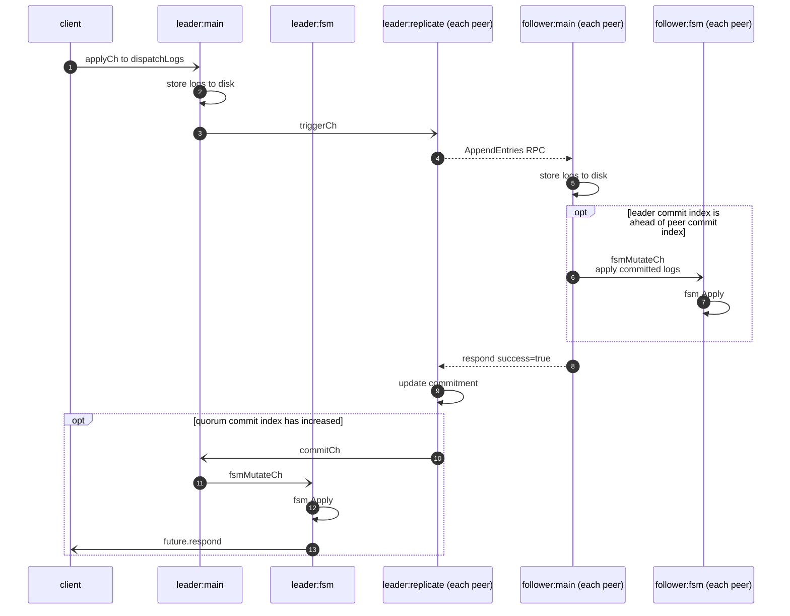

# Raft Apply

Apply is the primary operation provided by raft.

This sequence diagram shows the steps involved in a `raft.Apply` operation. Each box
across the top is a separate thread. The name in the box identifies the state of the peer
(leader or follower) and the thread (`<peer state>:<thread name>`). When there are
multiple copies of the thread, it is indicated with `(each peer)`.

